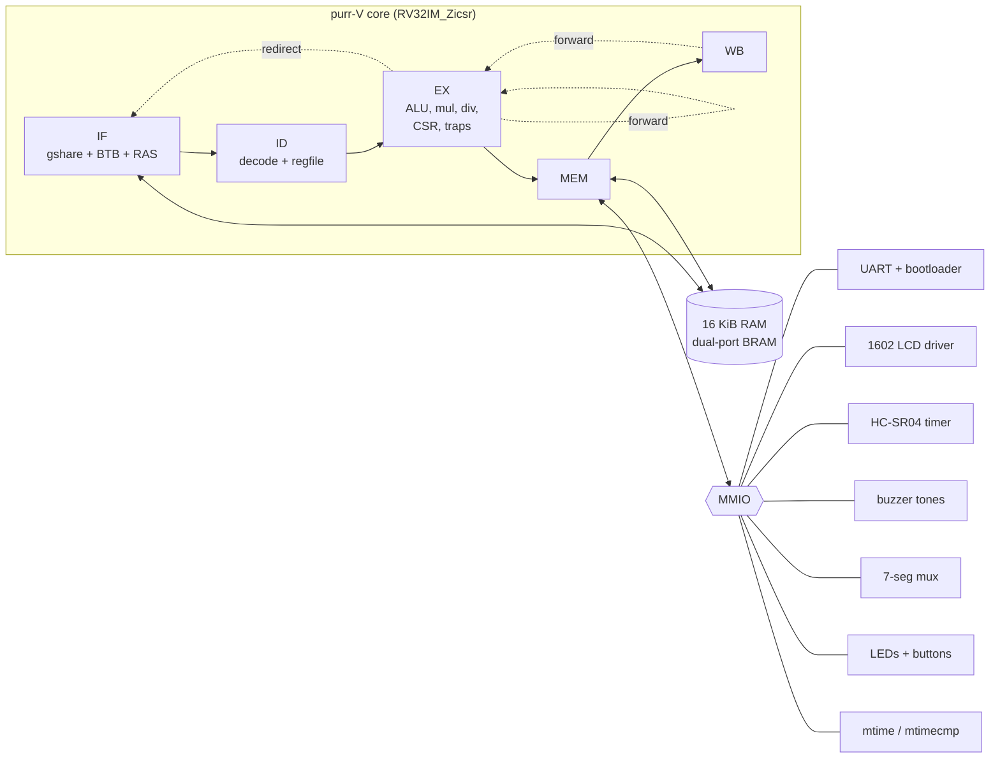

# purr-V :3

My own RISC-V CPU, written from scratch in SystemVerilog: a 5-stage pipelined
**RV32IM + Zicsr** core with a real branch predictor, interrupts, and hardware
drivers for the parts in the ELEGOO "Most Complete Starter Kit" (1602 LCD,
HC-SR04 ultrasonic sensor, buzzer, 4-digit 7-segment, buttons). It targets the
**Sipeed Tang Nano 9K** FPGA (~$25) and builds with a fully open-source toolchain.

It runs real C programs compiled with GCC, including a port of my
[arduino-parking-sensor](https://github.com/raffytaffy627/arduino-parking-sensor)
and a chrome-dino-style game on the LCD :p

**Status:** everything below is verified in simulation (Icarus Verilog) and the
design synthesizes + places + routes for the Tang Nano 9K at **30 MHz** (the
board clock is 27 MHz). I haven't run it on a physical board yet - I'm getting
a Tang Nano 9K next, and I'll update this with photos/video once it's on real
hardware (and fix whatever reality disagrees with :p).

```
+----------------+         purr-V parking sensor :3
|dist: 12 cm     |         Distance: 12 cm
|=============   |         Distance: 12 cm
+----------------+
   (the testbench's LCD model printing what the real 1602 would show)
```

## What's inside



### The core
- **RV32IM + Zicsr + Zifencei**: all of RV32I, hardware multiply (1 cycle, uses
  the FPGA's DSP block) and divide (33 cycles, radix-2), machine-mode CSRs
- **5-stage pipeline** (IF ID EX MEM WB) with full forwarding. The only stalls are
  a 1-cycle load-use bubble and the divider
- **Branch prediction**: 16-entry BTB, gshare (128 2-bit counters x 7 bits
  of global history), and a 4-deep **return address stack** so `ret` predicts
  right even when a function gets called from all over the place. A mispredict
  costs 3 cycles
- **Precise traps + interrupts**: ecall, ebreak, illegal instruction, misaligned
  load/store/jump, timer + external interrupts, `mret`, direct *and* vectored
  `mtvec`. Everything gets decided in EX, so anything older always finishes and
  anything younger gets flushed. No commit stage needed :o
- **Performance counters**: `mcycle`, `minstret`, and custom counters for
  mispredicts, branches resolved, load-use stalls and divider stalls, so I can
  actually *measure* the pipeline instead of guessing

### The SoC
| Address       | What                  | Notes |
|---------------|-----------------------|-------|
| `0x0000_0000` | 16 KiB RAM            | code + data + stack, dual-port BRAM (fetch + load/store at the same time) |
| `0x1000_0000` | UART                  | 115200 8N1, 16-byte RX FIFO, **bootloader snoops it** |
| `0x1000_1000` | GPIO                  | 6 LEDs, 4 hardware-debounced buttons, button-press interrupts |
| `0x1000_2000` | Timer                 | RISC-V `mtime`/`mtimecmp`, 1 µs tick |
| `0x1000_3000` | 1602 LCD              | hardware HD44780 driver: CPU drops bytes in a FIFO, hardware does all the timing |
| `0x1000_4000` | HC-SR04 sonar         | measures the echo pulse in hardware, auto-ping mode, interrupt when ready |
| `0x1000_5000` | Buzzer                | square wave in µs with an auto-stop timer (`tone(2000, 30)` and forget it) |
| `0x1000_6000` | 7-segment             | 4-digit hardware multiplexing, hex or raw segments |
| `0x1000_7000` | IRQ controller        | UART / button / sonar -> machine external interrupt |

- **UART bootloader**: send `PURR` + length + program + checksum and the hardware
  holds the CPU in reset, writes the new program into RAM and restarts it.
  Any time, no button, no re-synthesizing. `tools/flash.py` does it for you

## How I know it works

The part I'm proudest of is honestly the verification, not the CPU :3

1. **Random differential fuzzing.** `tools/iss.py` is a dumb, obviously-correct
   RV32IM simulator in Python (one instruction at a time, no pipeline).
   `tools/fuzz.py` generates random programs full of the stuff that breaks
   pipelines: back-to-back dependencies, load-use pairs, branches that flip
   between taken/not-taken, loops, calls + returns, and divide by zero /
   `INT_MIN / -1`. Then it runs them on **both** and diffs every single retired
   instruction and every store. **200/200 programs (~600 blocks each) match.**
   It found a real bug on its first run: the return address stack started
   uninitialized, so the first `ret` compared against X and silently skipped a
   redirect.
2. **Directed tests** (`tests/isa/traps.S`): 17 checks for everything random
   programs can't reach: every exception type, CSR read/set/clear semantics,
   read-only CSR writes, timer interrupts in direct + vectored mode, an
   interrupt landing mid-divide, M-extension edge cases, and `fence.i` with
   self-modifying code.
3. **Whole-system tests**: C programs running on the full SoC with models of the
   LCD, HC-SR04 and UART in the testbench, plus a test that flashes a program
   through the simulated UART bootloader while another program is running.

```
> python tools/run_tests.py
compiling RTL...
directed tests:
  [PASS] traps / irq / csr / fence.i  12549 instrs / 210767 cycles
programs:
  [PASS] hello (uart + lcd + M ext)   164839 instrs / 217962 cycles
  [PASS] parking (sonar @ 12 cm)      977549 instrs / 1463024 cycles
  [PASS] dino (lcd game, autopilot)   430908 instrs / 695360 cycles
bootloader:
  [PASS] flash hello over UART        163096 instrs / 511162 cycles
fuzzing (25 random programs vs the ISS):
  [PASS] random differential          25/25 passed :3
```

## Numbers

**FPGA (Tang Nano 9K, GW1NR-LV9, open-source flow):**

| Resource | Used | Available |
|----------|------|-----------|
| LUT4     | 6545 | 8640 (75%) |
| Flip-flops | 2553 | 6480 (39%) |
| Block RAM | 16 | 26 |
| DSP (MULT36X36) | 1 | 5 |
| **Fmax (post-route)** | **30.15 MHz** | board clock 27 MHz |

**Pipeline** (from the perf counters while running `hello`):
- CPI ~1.32. Most of that is the program polling the UART and LCD status
  registers (load -> branch = load-use bubble every time)
- ~98% of branches/jumps predicted right

Two things I learned the hard way while making it fit:
- yosys' default Gowin mapping turned my ALU into ~1000 LUTs. `-nowidelut`
  plus rewriting it to share ONE adder (add/sub/slt/sltu) and ONE shifter
  (sll = bit-reverse -> srl -> bit-reverse) got it way down. The whole design
  went from 96% of the chip (didn't place) to 75%.
- the first version hit 26.45 MHz, just under 27. The critical path was
  *load data from RAM -> forward into EX -> jalr target -> next PC -> RAM
  address*, all in one clock. Registering the redirect (mispredict penalty
  2 -> 3 cycles) got it to 30 MHz.

## Getting started

You need [Icarus Verilog](https://bleyer.org/icarus/) (v12+), Python 3, and a
RISC-V GCC ([xPack riscv-none-elf-gcc](https://github.com/xpack-dev-tools/riscv-none-elf-gcc-xpack/releases)
works great on Windows, or `gcc-riscv64-unknown-elf` on Ubuntu).

```bash
python tools/run_tests.py                 # build + run everything
python tools/build_sw.py sw/hello         # just compile a program
python tools/fuzz.py -n 100               # more random programs
```

Run one program in sim and watch it:
```bash
python tools/build_sw.py sw/parking -DSIM_DEMO
iverilog -g2012 -DSIM -I rtl/core -o build/sim.vvp sim/tb_soc.sv rtl/core/*.sv rtl/soc/*.sv rtl/periph/*.sv
vvp build/sim.vvp +hex=build/parking.hex +sonar_cm=12
```
(`+trace` prints every retired instruction, `+vcd` dumps waves for GTKWave)

### On the Tang Nano 9K

```bash
pip install yowasp-yosys yowasp-nextpnr-himbaechel-gowin apycula pyserial
python tools/build_fpga.py                # bitstream that boots into sw/parking
openFPGALoader -b tangnano9k build/purrv_tangnano9k.fs
python tools/flash.py COM5 build/dino.bin --monitor    # swap programs over USB
```

Wiring for the kit parts is in [docs/wiring.md](docs/wiring.md). **Please
read it first.** The FPGA is 3.3 V and a couple of the kit parts are 5 V.

## Writing programs

`sw/common/purrv.h` is a tiny "Arduino core" for purr-V:

```c
#include "purrv.h"

int main(void) {
    lcd_puts("hi :3");
    uint32_t cm = sonar_read_cm();
    if (cm < 10) tone(2000, 100);      // hardware stops it after 100 ms
    SEG_HEX = cm;
    delay_ms(500);
    print_perf();                      // cycles, CPI, mispredicts...
    return 0;
}
```

Interrupts are just a function with `__attribute__((interrupt("machine")))`
written into `mtvec`. See [sw/parking/main.c](sw/parking/main.c).

## Repo layout

```
rtl/core/     the CPU: pipeline, decoder, ALU, mul/div, branch predictor, CSRs
rtl/soc/      RAM, UART bootloader, SoC glue
rtl/periph/   UART, GPIO, timer, LCD, sonar, buzzer, 7-seg
fpga/         Tang Nano 9K top level + pin constraints
sim/          testbench with LCD / sonar / UART models
sw/           C programs + the purrv.h library
tests/        directed assembly tests
tools/        build, flash, ISS, fuzzer, test runner, FPGA build
docs/         wiring + design notes
```

## Inspiration

This was inspired by [f3rhd/rv_soc](https://github.com/f3rhd/rv_soc), a really
cool RV32IMF SoC with a hardware graphics accelerator that renders raycasting
and Mandelbrot demos. None of the code is copied. I wanted to build my own
from zero and go a different direction:

| | rv_soc | purr-V |
|---|---|---|
| ISA | RV32IMF (has an FPU!) | RV32IM + Zicsr + Zifencei |
| Branch prediction | gshare + BTB | gshare + BTB + return address stack |
| Interrupts / traps | none (no CSRs) | precise traps, timer + external IRQs, vectored mode |
| Graphics | hardware rasterizer -> ST7735 | - (a 1602 LCD driver lol) |
| Verification | testbench + bare-metal test programs | + ISS differential fuzzing, directed trap tests, CI |
| Toolchain | Vivado / Quartus | 100% open source (yosys / nextpnr / apycula) |
| Peripherals | UART bootloader, graphics, 7-seg, GPIO | UART bootloader, sonar, LCD, buzzer, 7-seg, buttons |

The FPU and graphics accelerator are way beyond what purr-V does, so maybe
that's next :o

## What I learned

- How a pipeline actually works once you have to make it *correct* and not
  just draw it: every forwarding path, every flush, and why a precise trap
  needs a single "point of no return" (EX here).
- Why verification is most of the work in real hardware. A random program
  generator plus a dumb reference model finds bugs I'd never think to write a
  test for.
- That FPGA timing is its own puzzle: the design was logically fine but one
  path was 0.5 MHz too slow, and fixing it meant changing the architecture,
  not the code.
- How much the Arduino was doing for me (`pulseIn`, `delayMicroseconds`,
  `LiquidCrystal`), and how nice it is to push that timing into hardware so the
  CPU is free.

## License

[The Rafin Hasan License](LICENSE). Use it for anything, just keep the credit :3
